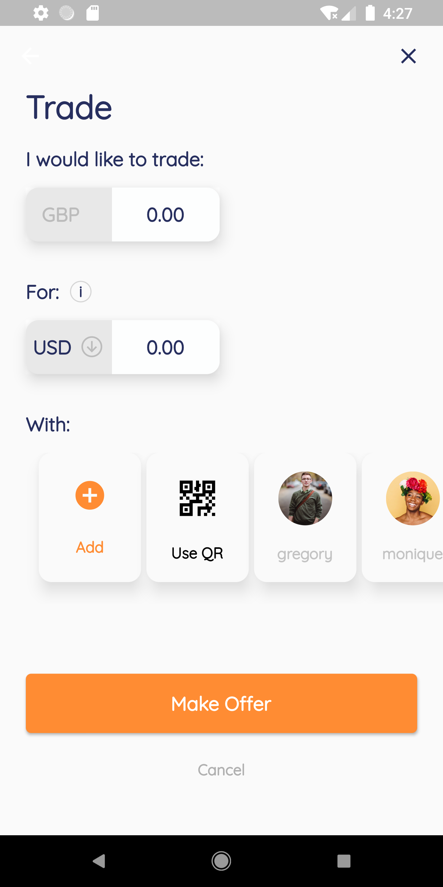
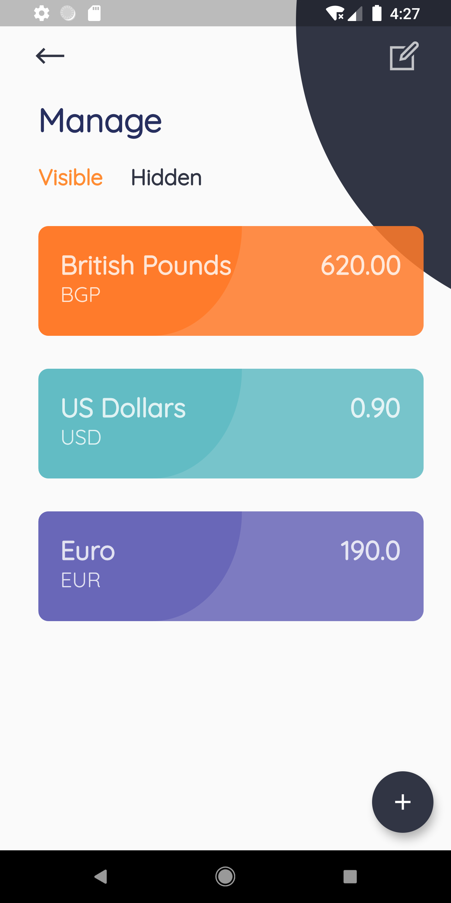

# Flutter UI for ToucanPay App

A Flutter representation of ToucanPay App UI design by <a href="https://dribbble.com/mjarosz">Michał Jarosz</a> in <a href="https://dribbble.com/shots/5886056-ToucanPay-App">Dribble</a>.

Star this repo if you like what you see.

## 📸 Screenshots

  

## Author(s)
**Emmanuel Fache**

## Getting Started

**Note**: Make sure your Flutter environment is setup.
#### Installation

In the command terminal, run the following commands:

    $ git clone https://github.com/emrade/flutter-ui-toucanpay-app.git toucanpay_app
    $ cd toucanpay_app/
    $ flutter run

##### Check out Flutter’s online [documentation](http://flutter.io/) for help getting started with your Flutter project.
